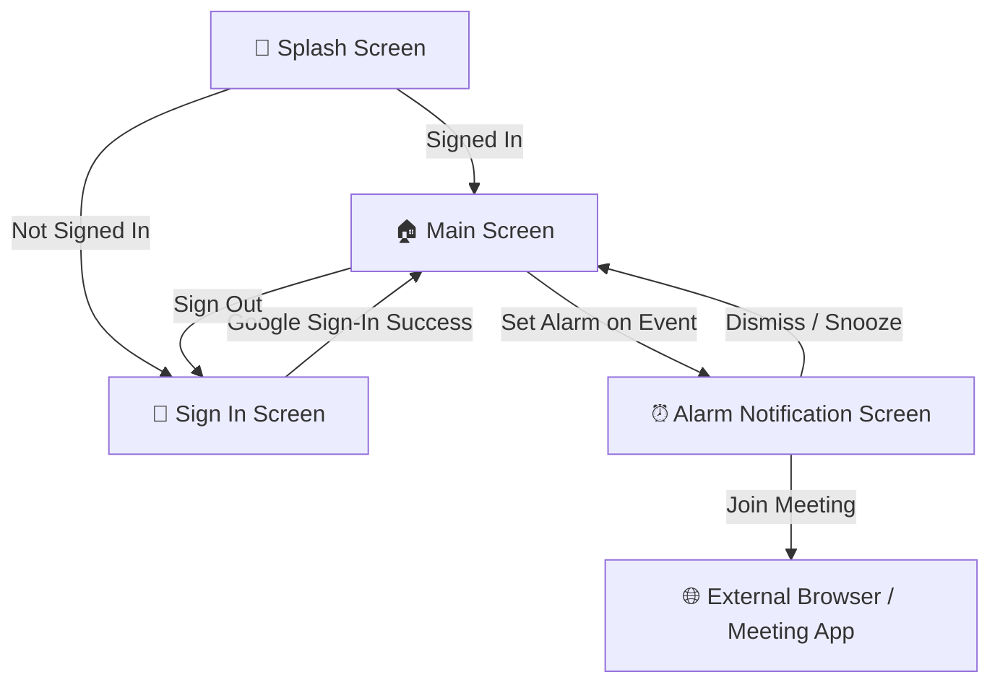
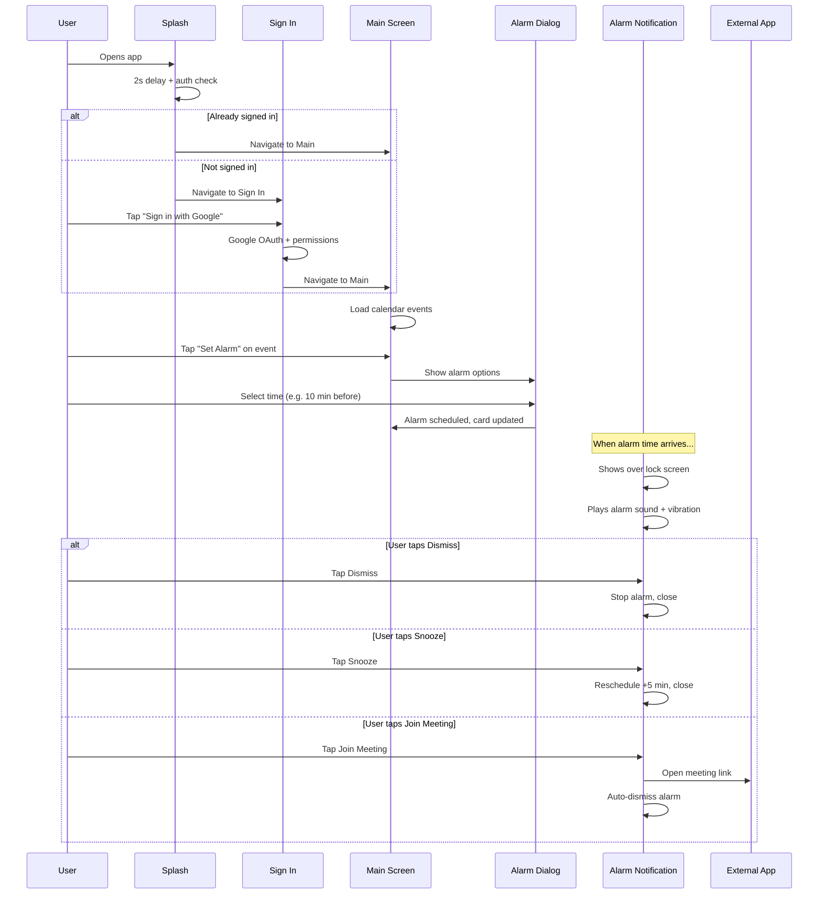

# 📱 Meeting Alarm — Screen-by-Screen Design Document

> **App Name:** Meeting Alarm (Alarmify)
> **Platform:** Android (Native Kotlin)
> **Design Language:** Deep Space Dark Mode — Premium glassmorphism, teal-blue gradients, and glow effects

---

## 🎨 Design System Overview

### Color Palette

| Token                | Hex         | Usage                          |
|----------------------|-------------|--------------------------------|
| `background_primary` | `#0D0D0F`   | Main dark background           |
| `surface`            | `#1A1A1E`   | Cards, dialogs                 |
| `primary`            | `#4B7BF5`   | Electric Cobalt — main actions |
| `secondary`          | `#2DD4BF`   | Soft Teal — secondary elements |
| `accent`             | `#F59E0B`   | Warm Amber — alarm indicators  |
| `text_primary`       | `#F5F5F7`   | Off-White — main text          |
| `text_secondary`     | `#9CA3AF`   | Cool Gray — muted text         |
| `join_button`        | `#10B981`   | Emerald — join meeting         |
| `danger`             | `#EF4444`   | Coral Red — critical/urgent    |

### Gradient

A **135° linear gradient** flows from **Soft Teal** (`#2DD4BF`) → **Electric Cobalt** (`#4B7BF5`) → **Deep Blue** (`#3A62C4`). This gradient is used on the splash, sign-in backgrounds, the main screen header, and primary action buttons.

### Typography

| Style       | Font                  | Size    | Weight     |
|-------------|-----------------------|---------|------------|
| Title       | `sans-serif-medium`   | 28–36sp | Bold       |
| Subtitle    | `sans-serif-light`    | 15–18sp | Regular    |
| Body        | `sans-serif`          | 14–16sp | Regular    |
| Caption     | `sans-serif`          | 12–13sp | Regular    |
| Time (Alarm)| `sans-serif-light`    | 52sp    | Regular    |

### Design Motifs

- **Liquid Glass Cards** — Frosted glass panels with subtle white borders and translucent backgrounds
- **Glow Circles** — Radial gradient orbs placed as decorative elements behind icons and in backgrounds
- **Gradient Accent Bars** — Thin vertical bars on event cards using the teal-to-blue gradient
- **Pulse Rings** — Concentric glow circles on the alarm notification screen to indicate urgency

---

## 🗺️ Navigation Flow



---

## Screen 1: 🚀 Splash Screen

**File:** `activity_splash.xml` → `SplashActivity.kt`
**Purpose:** App entry point. Displays branding while checking authentication status.

### Layout

```
┌─────────────────────────────────────────────┐
│              GRADIENT BACKGROUND            │
│          (Teal → Cobalt → Deep Blue)        │
│                                             │
│                                             │
│              ┌──────────────┐               │
│              │  🔔 Alarm    │               │
│              │   Logo Icon  │  140×140dp    │
│              │  (White tint)│               │
│              └──────────────┘               │
│                                             │
│           "Meeting Alarm"                   │
│             36sp • Bold • White             │
│           letter-spacing: 0.05              │
│                                             │
│          "Never miss a meeting"             │
│           18sp • Light • White (80%)        │
│                                             │
│                                             │
│              ◌  (Loading spinner)           │
│              48dp • White tint              │
│                                             │
│                                             │
└─────────────────────────────────────────────┘
```

### Design Details

- **Background:** Full-screen 135° teal-to-blue gradient
- **Icon:** App alarm logo, 140×140dp, white tinted, centered
- **App Name:** 36sp bold white with slight letter spacing
- **Tagline:** 18sp light white at 80% opacity
- **Loading Indicator:** 48dp white circular progress spinner
- All elements are vertically chain-packed in the center

### Behavior

- Displays for **2 seconds**, then checks Google Sign-In status
- If **signed in** → navigates to **Main Screen**
- If **not signed in** → navigates to **Sign In Screen**
- Activity finishes after navigation (no back-stack)

---

## Screen 2: 🔐 Sign In Screen

**File:** `activity_sign_in.xml` → `SignInActivity.kt`
**Purpose:** Authenticate user with Google account and request calendar/notification permissions.

### Layout

```
┌─────────────────────────────────────────────┐
│              GRADIENT BACKGROUND            │
│                                             │
│         ● Decorative glow orb (top-right)   │
│           200dp, 30% opacity                │
│                                             │
│    ┌─────────────────────────────────┐      │
│    │       LIQUID GLASS CARD         │      │
│    │    (Frosted translucent panel)   │      │
│    │                                 │      │
│    │        ╭───────────────╮        │      │
│    │        │  ● Glow Ring  │        │      │
│    │        │  🔔 Logo 80dp │        │      │
│    │        │  White tint   │        │      │
│    │        ╰───────────────╯        │      │
│    │                                 │      │
│    │       "Meeting Alarm"           │      │
│    │        34sp • Bold • White      │      │
│    │                                 │      │
│    │    "Never miss a meeting again! │      │
│    │     Set alarms for your Google  │      │
│    │        Calendar events"         │      │
│    │       15sp • White (85%)        │      │
│    │                                 │      │
│    │                                 │      │
│    │   ┌──────────────────────────┐  │      │
│    │   │  🔵  Sign in with Google │  │      │
│    │   │   64dp height • 6dp elev │  │      │
│    │   └──────────────────────────┘  │      │
│    │                                 │      │
│    └─────────────────────────────────┘      │
│                                             │
│         ● Decorative glow orb (bottom-left) │
│           150dp, 25% opacity                │
│                                             │
│     "By continuing, you agree to our        │
│      Terms of Service"                      │
│       12sp • White (50%)                    │
│                                             │
└─────────────────────────────────────────────┘
```

### Design Details

- **Background:** Same teal-to-blue gradient with 2 floating glow orbs
- **Glass Card:** Central content panel with `liquid_glass_card` drawable (frosted glassmorphism with translucent background and subtle white border)
- **Logo:** 80dp alarm icon centered inside a 140dp glow ring at 40% opacity
- **Title:** "Meeting Alarm" — 34sp bold white
- **Subtitle:** Two-line description — 15sp, white at 85% opacity, 6dp line spacing
- **Google Sign-In Button:** Full-width, 64dp height, `modern_google_btn` background, 6dp elevation, contains Google icon (24dp) + text "Sign in with Google" (16sp, `#1F1F1F` dark text)
- **Footer:** Terms of service note at bottom, 12sp, 50% opacity

### Behavior

1. Tapping **"Sign in with Google"** launches Google Sign-In intent with `CALENDAR_READONLY` scope
2. On success → shows welcome toast with user's display name
3. Checks permissions: `READ_CALENDAR`, `POST_NOTIFICATIONS` (Android 13+), `SCHEDULE_EXACT_ALARM`
4. Requests missing permissions via system dialog
5. Navigates to **Main Screen** regardless of permission outcome
6. Activity finishes (no back-stack to sign-in)

---

## Screen 3: 🏠 Main Screen (Events Dashboard)

**File:** `activity_main.xml` → `MainActivity.kt`
**Purpose:** Display upcoming Google Calendar events with alarm management.

### Layout

```
┌─────────────────────────────────────────────┐
│  GRADIENT HEADER (180dp height)             │
│  ┌────────────────────────────────────────┐ │
│  │ "My Events"            🔄  ┌────────┐ │ │
│  │  28sp Bold White        ↑  │ Logout │ │ │
│  │ "Upcoming meetings"    Ref  └────────┘ │ │
│  │  14sp White (80%)      resh            │ │
│  └────────────────────────────────────────┘ │
├─────────────────────────────────────────────┤
│  ↕ SWIPE-TO-REFRESH AREA                   │
│                                             │
│  ┌──── EVENT CARD ──────────────────────┐  │
│  │  ▌ "Team Standup Meeting"     🔔     │  │
│  │  ▌  gradient   17sp • text_primary  Active│
│  │  ▌  accent     "15 Dec, 10:30 AM"   badge│
│  │  ▌  bar        13sp • text_secondary     │
│  │  │─────────────────────────────────────│  │
│  │  │           Cancel  ┃ Join  ┃ Set Alarm │
│  │  │            text    text    gradient btn│
│  └──────────────────────────────────────────┘  │
│                                             │
│  ┌──── EVENT CARD ──────────────────────┐  │
│  │  ▌ "Design Review"                  │  │
│  │  ▌  "15 Dec, 2:00 PM"               │  │
│  │  │─────────────────────────────────────│  │
│  │  │                     Join  ┃ Set Alarm │
│  └──────────────────────────────────────────┘  │
│                                             │
│  ... (scrollable list)                      │
│                                             │
├ ─ ─ ─ ─ ─ EMPTY STATE ─ ─ ─ ─ ─ ─ ─ ─ ─ ─┤
│  (shown when no events)                     │
│               ╭──────────╮                  │
│               │  ● Glow  │                  │
│               │  🔔 Icon │  60dp, gray tint │
│               ╰──────────╯                  │
│         "No upcoming events"                │
│           18sp • text_secondary             │
│     "Pull down to refresh your calendar"    │
│           14sp • text_tertiary (70%)        │
└─────────────────────────────────────────────┘
```

### Component: Event Card (`item_event.xml`)

Each event is rendered as a card with:

| Element                | Details                                                                   |
|------------------------|---------------------------------------------------------------------------|
| **Card background**    | `event_card_background` — dark surface with rounded corners & subtle border |
| **Gradient accent bar**| 4×48dp vertical bar on the left using teal-to-blue gradient               |
| **Title**              | 17sp, `sans-serif-medium`, `text_primary` (#F5F5F7), max 2 lines         |
| **Time**               | 13sp, `sans-serif`, `text_secondary` (#9CA3AF), e.g. "15 Dec 2024, 10:30 AM" |
| **Alarm badge**        | Shown when alarm is set — glass pill with green dot + "Active" label      |
| **Divider**            | 1dp line, white at 10% opacity                                           |
| **Set Alarm button**   | Gradient background (`gradient_button_modern`), 14sp white, min 120dp wide |
| **Cancel button**      | Text-only, `text_tertiary` color, shown only when alarm is set            |
| **Join button**        | Text-only, emerald green (`#10B981`), shown only when meeting link exists |

### Header Design

- **180dp gradient background** bleeds beneath the toolbar
- **Transparent AppBarLayout** with no elevation for seamless gradient effect
- **Left section:** "My Events" title (28sp bold white) + "Upcoming meetings" subtitle (14sp, 80% opacity)
- **Right section:** Refresh icon button (44dp, white) + Logout pill button (40dp height, `button_dismiss_modern` background, icon + "Logout" text in `text_secondary`)

### Behavior

- **Pull-to-refresh:** SwipeRefreshLayout reloads calendar events
- **Refresh button:** Same action as pull-to-refresh
- **Set Alarm tap:** Opens alarm options dialog (see below)
- **Cancel Alarm tap:** Cancels scheduled alarm, updates card state
- **Join tap:** Opens meeting link in external browser/app
- **Sign Out tap:** Confirmation dialog → signs out of Google → returns to Sign In Screen

### Dialog: Alarm Options

```
┌──────────────────────────────────┐
│  Set alarm for "Team Standup"    │
│──────────────────────────────────│
│  5 minutes before                │
│  10 minutes before               │
│  15 minutes before               │
│  30 minutes before               │
│  60 minutes before               │
│  Custom                          │
│──────────────────────────────────│
│                         Cancel   │
└──────────────────────────────────┘
```

Selecting **"Custom"** opens a secondary dialog with a number input field for minutes.

---

## Screen 4: ⏰ Alarm Notification Screen

**File:** `activity_alarm_notification.xml` → `AlarmNotificationActivity.kt`
**Purpose:** Full-screen alarm alert when a meeting reminder fires. Appears over lock screen.

### Layout

```
┌─────────────────────────────────────────────┐
│          DARK BACKGROUND (#1A1A1E)          │
│                                             │
│      ● Glow orb (top-right, 300dp, 15%)     │
│                                             │
│              ╭─────────────────╮            │
│              │  ◯ Outer pulse  │  240dp     │
│              │  ◯ Mid pulse    │  180dp     │
│              │  ◯ Inner pulse  │  120dp     │
│              │   🔔 Ringing    │  72dp      │
│              │   Alarm Icon    │  White     │
│              ╰─────────────────╯            │
│                                             │
│    ┌─────────────────────────────────┐      │
│    │       LIQUID GLASS CARD         │      │
│    │                                 │      │
│    │     "MEETING REMINDER"          │      │
│    │      12sp • Teal • Bold • 0.15  │      │
│    │                                 │      │
│    │   "Team Standup Meeting"        │      │
│    │     24sp • White • Bold         │      │
│    │                                 │      │
│    │     ━━━━━━━━━━ (gradient line)  │      │
│    │                                 │      │
│    │         10:30 AM                │      │
│    │          52sp • White • Light   │      │
│    │                                 │      │
│    │     Today, Dec 15 2024          │      │
│    │      16sp • White (75%)         │      │
│    │                                 │      │
│    │    ┌─────────────────────┐      │      │
│    │    │ 🔗 Join via Google  │      │      │
│    │    │     Meet            │  glass pill  │
│    │    └─────────────────────┘      │      │
│    │                                 │      │
│    └─────────────────────────────────┘      │
│                                             │
│   ┌──────────────────────────────────────┐  │
│   │      🔗  Join Meeting               │  │
│   │       Full-width • 60dp • Green      │  │
│   └──────────────────────────────────────┘  │
│                                             │
│   ┌────────────────┐  ┌─────────────────┐  │
│   │  😴  Snooze    │  │  ✕  Dismiss     │  │
│   │  Teal bg • 60dp│  │  Gray bg • 60dp │  │
│   └────────────────┘  └─────────────────┘  │
│                                             │
│      ● Glow orb (bottom-left, 200dp, 10%)  │
│                                             │
└─────────────────────────────────────────────┘
```

### Design Details

- **Background:** Soft black (`#1A1A1E`) with 2 decorative glow orbs at very low opacity
- **Pulse Rings:** 3 concentric glow circles (240dp → 180dp → 120dp) at 10% / 20% / 40% opacity, centering the 72dp ringing alarm icon in white
- **Glass Content Card:** `liquid_glass_card` frosted panel with:
  - "MEETING REMINDER" label — 12sp, teal (`#2DD4BF`), bold, wide letter-spacing (0.15)
  - Event title — 24sp, white, bold
  - Gradient divider line — 80×4dp
  - Time — **52sp**, light weight, white — the largest element, designed for at-a-glance readability
  - Date — 16sp, white at 75% opacity
  - Meeting link pill (optional) — glass background with link icon + platform label (Google Meet / Zoom / Teams / Webex)
- **Action Buttons:**
  - **Join Meeting** (optional) — Full-width, 60dp, green gradient, white text + join icon, 16dp rounded corners
  - **Snooze** — Half-width, 60dp, teal background (`button_snooze_modern`), white text + snooze icon
  - **Dismiss** — Half-width, 60dp, gray background (`button_dismiss_modern`), gray text + dismiss icon
  - 16dp gap between Snooze and Dismiss

### Lock Screen Behavior

- **Shows on lock screen** — `setShowWhenLocked(true)` + `setTurnScreenOn(true)`
- **Screen stays on** — `FLAG_KEEP_SCREEN_ON`
- **Back button disabled** — User must explicitly Snooze or Dismiss
- **Smart meeting link detection** — Identifies Google Meet, Zoom, Teams, and Webex from the URL

### Behavior

| Action         | Result                                                                 |
|----------------|------------------------------------------------------------------------|
| **Dismiss**    | Stops alarm service, closes screen                                     |
| **Snooze**     | Reschedules alarm for 5 minutes later, closes screen                   |
| **Join Meeting** | Opens meeting link in external app, then auto-dismisses alarm        |

---

## 🔔 Background Services (Non-Screen Components)

While not visual screens, these components power the alarm experience:

### AlarmService

- Runs as a **foreground service** with a notification
- Plays alarm sound and triggers vibration
- Handles `ACTION_DISMISS` and `ACTION_SNOOZE` intents

### AlarmReceiver

- `BroadcastReceiver` that fires when `AlarmManager` triggers
- Starts the `AlarmService` and launches `AlarmNotificationActivity`

### BootReceiver

- Reschedules all active alarms after device reboot
- Listens for `BOOT_COMPLETED` broadcast

### NativeAlarmManager

- Wraps Android's `AlarmManager` for setting exact alarms
- Calculates alarm time: `event.startTime - (minutesBefore × 60 × 1000)`
- Attaches event metadata (title, start time, meeting link) to alarm intents

---

## 📐 Complete User Flow



---

*Generated on 15 Feb 2026 — Meeting Alarm (Alarmify) v1.0*
